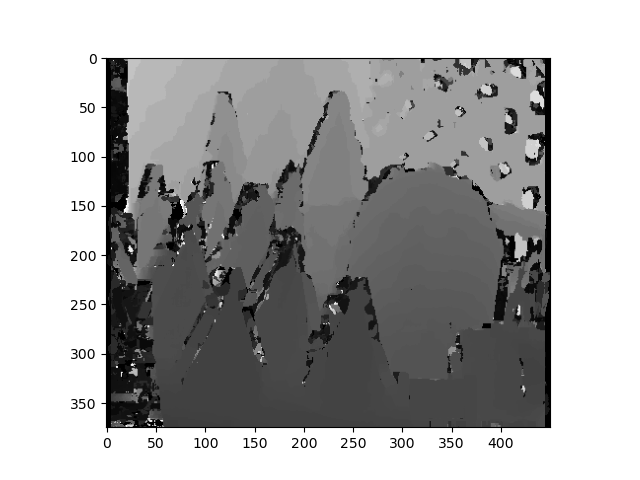

# Depth-from-Disparity

## Task
Given a pair of images, compute a depth image of the scene by computing the disparity map between the pair.  A disparity map (or flow) is an image that stores the displacement that leads every pixel in an image X to its corresponding pixel in the image X′. The depth image is inversely proportional to the disparity.

## Input

## Output
